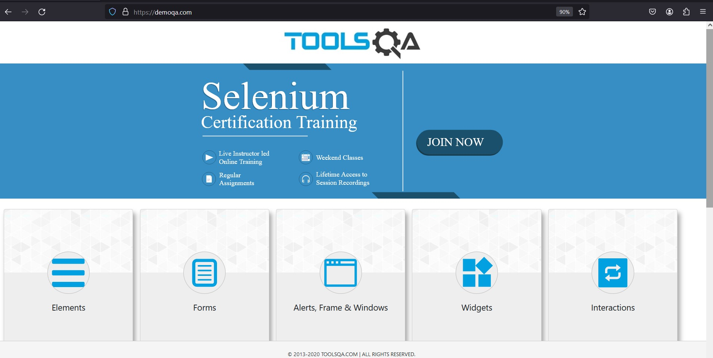
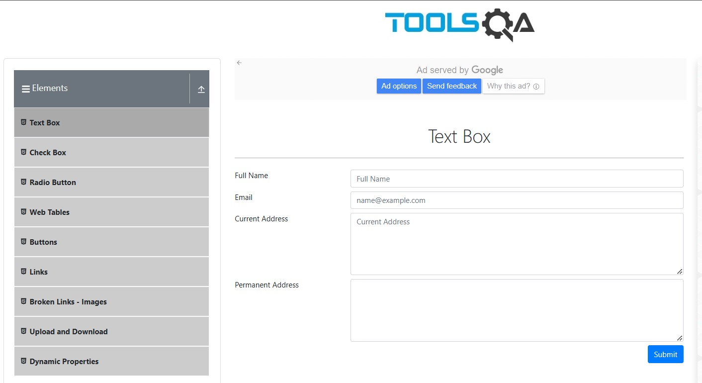
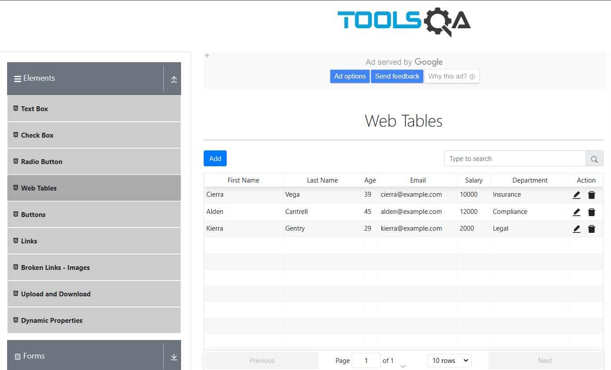
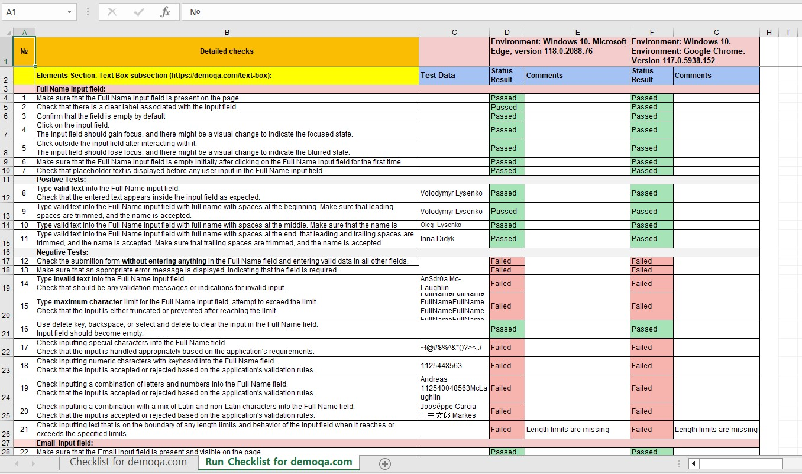

# Сhecklists template and test run for the demoqa.com website. 
Manual Software Testing

 

## Don't forget to give a :star: to make the project popular :) 

## :boom: The task and what needs to be done?
- Write a checklist for the demoqa .com website, covering all the functionality with tests as much as possible. 
- Make it in an Excel spreadsheet

 
  

## :bulb: The result:
- The checklist for the demoqa .com website was written, covering all the functionality with tests as much as possible. 
- The result was drawn up in an Excel spreadsheet.
- Wound test was done.

### Test Run result
 

